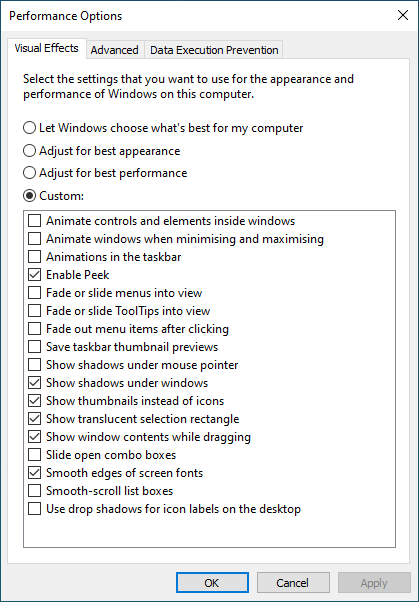
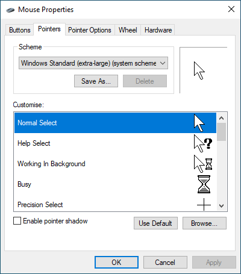
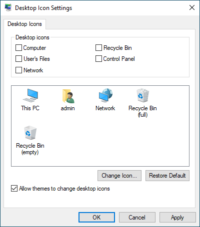

# New Windows PC setup

## Taskbar
Right click taskbar
- Search > Hidden
- News and interests > Turn off
- uncheck **Show Cortana button**
- uncheck **Show Task View button**

Unpin from taskbar
- Microsoft Store
- Mail
- Meet now > Hide

Settings > Turn system icons on or off
- Meet Now

## Visual performance and enhancements
Windows key > Control panel > Adjust the appearance and performance of Windows

## Mouse pointer
Windows key > Control panel > Mouse

## Remove Recycle Bin from desktop
Settings > Theme and related settings > Desktop icon settings

## Explorer shell
- show file extensions
- Navigation pane > Expand to open folder
- other stuff...

## Applications
Install using [Ninite](https://ninite.com/)

Always install:
- Notepad++
- 7-Zip
- Open-Shell

## Fonts
- [DejaVu fonts](https://dejavu-fonts.github.io/) 
  http://sourceforge.net/projects/dejavu/files/dejavu/2.37/dejavu-fonts-ttf-2.37.zip
- [JetBrains Mono](https://www.jetbrains.com/lp/mono/)

## Command prompt
- font
- window size

## Open-Shell
Load from XML file:

[open-shell-settings.xml](open-shell-settings.xml)

## Firefox
### Addons
- LastPass: Free Password Manager
- Adblock Plus - https://addons.mozilla.org/en-GB/firefox/addon/adblock-plus/
- DontBugMe - https://addons.mozilla.org/en-US/firefox/addon/dontbugme/
- New Tab Override - https://addons.mozilla.org/en-US/firefox/addon/new-tab-override/
  - Custom URL: https://www.startpage.com/
  - Set focus to the web page
- Startpage - https://addons.mozilla.org/en-GB/firefox/addon/startpage-private-search/
- Web Developer - https://addons.mozilla.org/en-GB/firefox/addon/web-developer/

### Customise
- Title bar [x]
- Toolbars: Menu bar

### Tabs on bottom
about:config
- toolkit.legacyUserProfileCustomizations.stylesheets > true
- browser.tabs.insertAfterCurrent > true

Help > More Troubleshooting Information > open profile directory

Create `chrome` directory if not present

Copy [userChrome.css](chrome/userChrome.css) and [tabs_on_bottom_v2.css](chrome/tabs_on_bottom_v2.css)

## Notepad++
- Settings > Preferences > Cloud

TODO: add settings file

## Visual Studio
- Import settings from backup
- Tools > Options > Source Control > Configure User Tools

ReSharper (dotsettings file?)

## Tortoise Git
Still need to install Git for Windows also

## Tortoise Diff
  font, colours, settings (.reg file)

